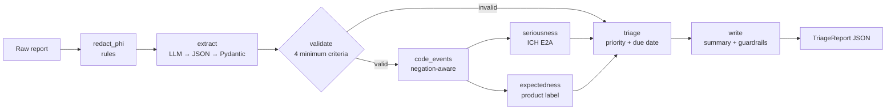

# PV Case Triage Agents

[](https://github.com/gopipamulapati/pv-case-triage-agents/actions/workflows/ci.yml)


A **multi-agent pharmacovigilance (drug safety) triage system** built with **LangGraph**.
It takes a free-text adverse event report and:

1. **Removes protected health information (PHI)** before any model sees the text.
2. **Extracts** the case: patient, reporter, suspect drug, dose, narrative and outcome.
3. Checks the four **minimum criteria for a valid case**.
4. **Codes** the reported events to preferred terms.
5. Assesses **seriousness** (ICH E2A criteria) and **expectedness** (against the product label) in parallel.
6. Assigns a **triage priority and due date**.
7. Writes a **case summary** for a human safety reviewer.

It's served through **FastAPI**, packaged with **Docker**, and tested in **GitHub Actions**.
It runs fully offline by default, and the model is switched to **OpenAI** or **AWS Bedrock**
with one environment variable.

> **Synthetic data only.** The products (Zentravir, Cardiolex, Glucofen), their labels,
> the patients and the reports are all fictional. The event vocabulary is a small
> illustrative list written for this project, **not MedDRA**. Timelines are simplified.
> This is a portfolio project, not a clinical or regulatory tool.

---

## Why it's built this way

Drug safety is regulated, so the split between the LLM and deterministic code matters:

| Concern | Who handles it | Why |
|---|---|---|
| Removing PHI | **Rules, run first** | Must be predictable and happen before text reaches a hosted model |
| Reading the messy report | **LLM** (JSON checked against a Pydantic schema) | Unstructured text is where LLMs help most |
| Event coding, seriousness, expectedness | **Deterministic rules with evidence** | They drive reporting deadlines and must be auditable |
| Case summary | **LLM**, with two guardrails | Readable output that can't change the triage or leak PHI |
| Final decision | **Human safety reviewer** | The system only pre-triages |

Guardrails built in:

- **PHI never reaches the model.** Names, phone numbers, emails, SSNs, MRNs, dates of birth
  and street addresses are redacted first. A test records every input the LLM receives and
  asserts none of the original values appear.
- **PHI leak check on output.** If an LLM-written summary contains any redacted value (even an
  MRN without its "MRN:" label), it's rejected and the template summary is used.
- **Priority lock.** If the LLM's summary drops or changes the triage label, it's rejected.
- **Negation-aware coding.** "Patient denies chest pain" and "was not admitted" don't create
  events or seriousness criteria.
- **Evidence for every criterion.** Each seriousness criterion records the phrase that
  triggered it, so a reviewer can check it in seconds.
- **Conservative defaults.** An unknown product has no label, so its events count as
  unlisted, which can only make triage stricter.

## Architecture



### Triage rules

| Case | Priority | Due (from receipt) |
|---|---|---|
| Missing a minimum criterion (patient, reporter, named drug, event) | `follow_up_required` | 7 days |
| Serious **and** at least one unlisted event | `expedited` | 15 days |
| Serious, all events listed | `priority` | 30 days |
| Non-serious | `routine` | 90 days |

Seriousness criteria: death, life-threatening, hospitalization, disability, congenital
anomaly, or a medically important event (for example anaphylaxis, seizure or hepatic
failure). An emergency-department visit without admission is **not** hospitalization.

## Quick start

```bash
git clone https://github.com/gopipamulapati/pv-case-triage-agents.git
cd pv-case-triage-agents
python -m venv .venv && source .venv/bin/activate
pip install -e ".[dev]"

pv-triage samples/*.txt        # triage the 8 sample reports
python scripts/evaluate.py     # score against hand-labelled gold cases
pytest -q                      # 45 tests, no API key needed
```

Example output:

```
=== 02_liver_failure_unexpected.txt -> expedited ===

## Case triage: EXPEDITED

**Due:** 2026-10-05
**Reason:** Serious (hospitalization, medically_important) and unexpected (Hepatic failure, Jaundice).

- **Suspect product:** Zentravir (200 mg twice daily)
- **Patient:** 52y, male
- **Reporter:** pharmacist
- **Outcome:** recovering

### Events
| Verbatim | Preferred term | Body system | Label |
|---|---|---|---|
| fatigue | Fatigue | General | listed |
| raised ALT | Hepatic enzyme increased | Hepatobiliary | listed |
| liver failure | Hepatic failure | Hepatobiliary | **unlisted** |
| yellow eyes | Jaundice | Hepatobiliary | **unlisted** |

### Seriousness: SERIOUS
- hospitalization: 'hospitalized'
- medically_important: Hepatic failure

PHI redacted before processing: ADDRESSx1, EMAILx1, MRNx1, NAMEx2
```

## Evaluation

`scripts/evaluate.py` scores the pipeline against 8 hand-labelled synthetic reports in
`samples/gold_labels.json`. The set covers every triage outcome and the tricky cases:
negations, an ED visit without admission, a fatal but listed event, an unknown product,
and a consumer report with no named drug.

```
triage priority accuracy: 8/8
seriousness accuracy:     7/7
event coding precision:   100%   recall: 100%
```

> Honest caveat: these cases were written alongside the rules, so this is a regression
> check, not an independent benchmark. Real reports are far messier, which is where the
> LLM extraction path and a much larger vocabulary would come in.

## Use a real LLM

```bash
cp .env.example .env
pip install -e ".[openai]"   && export LLM_PROVIDER=openai OPENAI_API_KEY=sk-...
# or
pip install -e ".[bedrock]"  && export LLM_PROVIDER=bedrock AWS_REGION=us-east-1
```

## REST API

```bash
uvicorn pv_triage.api:app --reload
# or
docker build -t pv-triage . && docker run -p 8000:8000 pv-triage
```

```bash
curl -X POST localhost:8000/triage -H "content-type: application/json" \
  -d "{\"text\": $(jq -Rs . < samples/01_angioedema_hospitalized.txt)}"
```

The response contains only redacted, structured data. Raw PHI values are never returned.

## Project layout

```
src/pv_triage/
├── graph.py            # LangGraph StateGraph: routing, parallel branches, tracing
├── agents/
│   ├── phi.py          # PHI redaction + output leak check
│   ├── extractor.py    # LLM JSON extraction with Pydantic validation + rule fallback
│   ├── clinical.py     # negation-aware coding, seriousness, expectedness
│   ├── triage.py       # priority and due date
│   └── writer.py       # case summary with priority-lock and PHI-leak guardrails
├── data/               # illustrative event vocabulary + fictional product labels
├── knowledge.py        # loads reference data, medically important events
├── config.py           # timelines
├── llm.py              # Offline / OpenAI / Bedrock providers
├── api.py              # FastAPI service
└── cli.py              # `pv-triage` command
```

## Roadmap

- [ ] Duplicate-case detection across reports
- [ ] Causality assessment support (time to onset, dechallenge / rechallenge)
- [ ] Human-in-the-loop review queue using LangGraph interrupts
- [ ] E2B(R3)-style structured export

## License

MIT © Gopi Pamulapati
